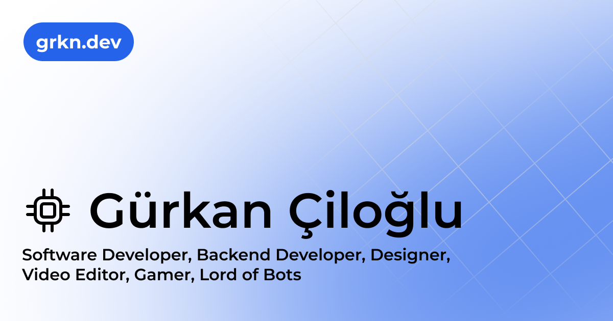

# grkn.dev



<br>
<br>

My personal website has evolved over the years from a simple static HTML page to `Create React App`, `Next.js`, `TailwindCSS` and
`With content`. It acts as an app-like web platform for my writing, highlighting my journey, showcasing my bookmarks, and more.

## Overview

- `/` - Home page.
- `/[slug]` - Static pre-rendered pages. (e.g. `/`, `/about`)
- `/api` - API routes.

## Running Locally

```bash
$ git clone https://github.com/GweepCreative/grkn.dev.git
$ cd grkndev
$ yarn
$ yarn dev
```

Create a `.env` file similar to [`.env.example`](https://github.com/gweepcreative/grkndev/blob/master/.env.example).

## Built With

- [Next.js](https://nextjs.org)
- [Tailwind CSS](https://tailwindcss.com)
- [Vercel](https://vercel.com)